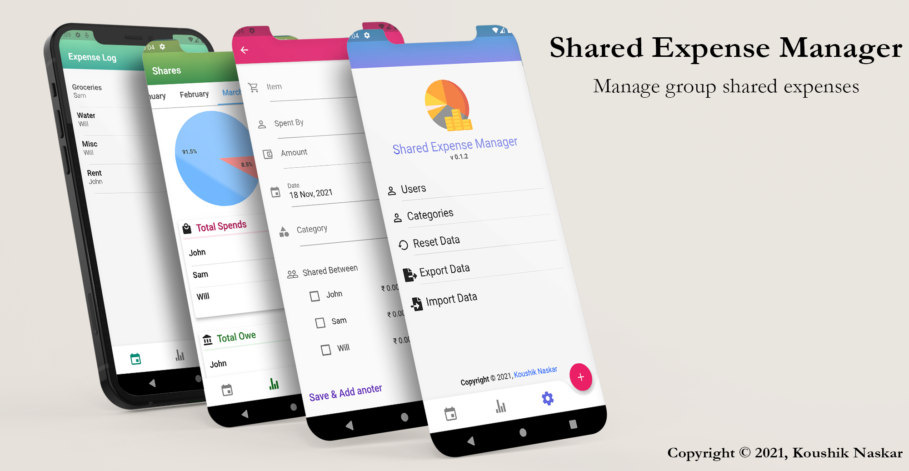

    
  <h2 align="center">Shared Expense Manager</h2>
  <h3 align="center">App for managing group shared expenses.</h3>

  
  
  

---  

  

A Simeple app for managing group shared expenses. Just add users group and categories, and enter individual expense records to keep track of the group shares.  
Built with [Flutter](https://flutter.dev/) framework, this app can be compiled for both Andoroid and iOS.

### Usage 
* **Download** the app from the [release section](https://github.com/Koushikphy/Shared-Expense-Manager/releases).
* Add list of users and categories seperated by comma (,) in the setting page.
* Tap on the `+` button to add new expense record.
* Check the Stats page for current expenses status.
* Tap on individual record in the log page to edit/delete them.  
* Save/Load expense record to/from local file from the setting page.

 TODOs: 

1. - [x] Introduction to flutter and dart programming language.
2. - [x] Setup flutter and a sample starting project.
3. - [x] Android studio setup with virtual device + real device adb.
4. - [x] Overall pages layout design
    1. - [x] Page to log all expenses and show them in a list view.
    2. - [x] Page to display details of a single entry.
    3. - [x] Dashboard page to display the shares
    6. - [ ] Chart pages ? > Time Series/Pie category
    5. - [x] Profile/Setting page to edit users list, categories, import/export settings
    4. - [x] Add new entry page
    5. - [x] Change pages with swipe
5. - [x] Transition between pages.
6. - [x] Flutter Form design with validation.
7. - [x] Flutter state management and update parent/child/sibling UI on data changes .
8. - [x] Math logic to calculate shares.
8. - [x] Unequal shares of expenses.
9. - [x] Initial UI state, when no data is present.
10. - [x] Save and persist data on app restart.
11. - [x] Import/Export data (JSON ?) also as an Excel sheet?
12. - [x] Add custom icon for production app.
13. - [x] App signing for distribution.
11. - [ ] Pages to add users and categories
14. - [ ] Sort the data according to time at modification.
13. - [x] Mocks for presentation 
13. - [x] First sharable production build.
14. - [ ] Introduce search functionality to the log page.
15. - [ ] Separate data into months and a provide a option to set it.
15. - [ ] Firebase authentication to sync between multiple devices.  

  

 

Icons made by <a href="https://www.freepik.com" title="Freepik">Freepik</a> from <a href="https://www.flaticon.com/" title="Flaticon">www.flaticon.com</a>
